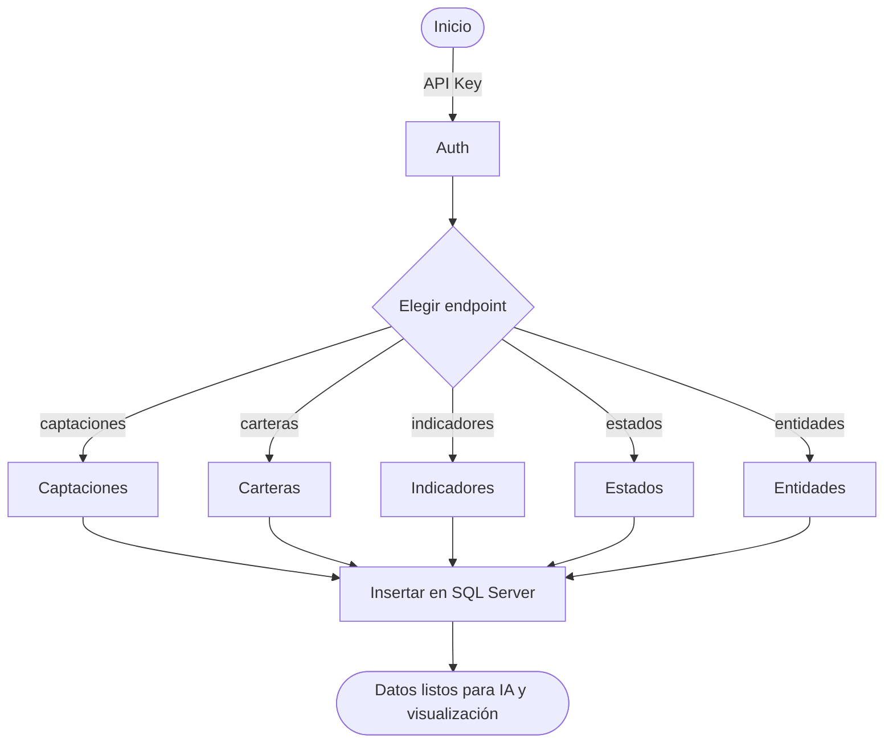

# PeopleWorks Finance Console


Una herramienta de consola desarrollada por el equipo de **PeopleWorks** para obtener y analizar las estadísticas del sistema financiero de la República Dominicana, conectándose directamente al API oficial de la Superintendencia de Bancos (SB).

## 🌐 Objetivo

Cargar y almacenar información actualizada sobre:

* Captaciones
* Carteras de créditos
* Estados de situación
* Indicadores financieros
* Instituciones financieras

Y guardarla en SQL Server para ser analizada por herramientas de inteligencia artificial como [PeopleWorks GPT](https://peopleworksgpt.com/).

---

## ⚙️ Requisitos

* .NET 9 SDK
* SQL Server (con las tablas ya creadas)
* Clave de API válida desde: [https://desarrollador.sb.gob.do](https://desarrollador.sb.gob.do)
* Sistema operativo Windows o Linux

> 💡 **Importante:** Asegúrate de que los campos de tipo texto en tus tablas tengan suficiente longitud para evitar errores de truncamiento (por ejemplo, `TipoEntidad` y `Divisa` al menos `NVARCHAR(50)` o más).

---

## 🚀 Ejecución básica

```bash
PeopleWorksFinanceConsole.exe --endpoint=captaciones --inicio=2024-01 --fin=2024-01 --persona=fisica --guardarbd=true
```

### Otros ejemplos

#### 1. Obtener carteras

```bash
PeopleWorksFinanceConsole.exe --endpoint=carteras --inicio=2023-01 --fin=2023-12 --guardarbd=true
```

#### 2. Obtener estados financieros

```bash
PeopleWorksFinanceConsole.exe --endpoint=estados --inicio=2023-01 --fin=2023-12 --guardarbd=true
```

#### 3. Obtener indicadores financieros

```bash
PeopleWorksFinanceConsole.exe --endpoint=indicadores --inicio=2023-01 --fin=2023-12 --guardarbd=true
```

#### 4. Obtener instituciones financieras

```bash
PeopleWorksFinanceConsole.exe --endpoint=entidades --guardarbd=true
```

---

## 📊 Almacenamiento en Base de Datos

Todos los datos se insertan en SQL Server en tablas como:

* `Captacion`
* `Cartera`
* `Indicador`
* `EstadoFinanciero`
* `Entidad`

> 📁 Puedes usar el script SQL incluido en `database/EstadisticasFinancieras.sql` para crear toda la base de datos con las columnas ya ajustadas para evitar errores de truncamiento.

---

## 💡 Consejos para pruebas

Para validar que todo funciona antes de ejecutar procesos grandes, puedes:

* Ejecutar primero `--endpoint=entidades` para poblar instituciones.
* Usar fechas cortas como `--inicio=2024-01 --fin=2024-01`.
* Agregar `--guardarbd=true` para insertar directamente.
* Revisar la tabla destino con `SELECT COUNT(*)`.

---

## 📆 Automatización sugerida

Puedes programar este proceso con el **Programador de tareas de Windows**, `cron` en Linux o un archivo `.bat` con variables:

```bat
set EXE=PeopleWorksFinanceConsole.exe
set INICIO=2024-01
set FIN=2024-01

%EXE% --endpoint=captaciones --inicio=%INICIO% --fin=%FIN% --persona=fisica --guardarbd=true
```

---

## 📏 Diagrama del flujo



---

## 📚 Diccionario de Tablas y Campos

### 1. Entidades

**Descripción:** Contiene las instituciones financieras registradas por la SB.

| Campo       | Descripción                              |
| ----------- | ---------------------------------------- |
| Id          | Código interno de la base de datos       |
| Nombre      | Nombre oficial de la entidad financiera  |
| TipoEntidad | Tipo de institución (AAyP, BM, EP, etc.) |

---

### 2. Captaciones

**Descripción:** Muestra los montos captados por cada entidad por tipo de persona.

| Campo       | Descripción                                                     |
| ----------- | --------------------------------------------------------------- |
| Periodo     | Año-Mes de los datos (formato YYYY-MM)                          |
| TipoEntidad | Tipo de institución (ej. "Asociaciones de Ahorros y Préstamos") |
| Entidad     | Nombre de la institución                                        |
| Persona     | Persona física o jurídica                                       |
| Producto    | Tipo de instrumento financiero captado (Ahorros, Depósitos)     |
| Monto       | Valor monetario captado                                         |
| Divisa      | Moneda del monto captado (ej. PESO DOMINICANO)                  |

> 🔎 Recomendación: Usa `NVARCHAR(100)` para `TipoEntidad` y `Divisa`.

---

### 3. Carteras

**Descripción:** Información de los préstamos otorgados por las entidades.

| Campo           | Descripción                       |
| --------------- | --------------------------------- |
| Periodo         | Año-Mes del registro              |
| TipoEntidad     | Tipo de institución               |
| Entidad         | Nombre de la institución          |
| TipoCredito     | Tipo de préstamo otorgado         |
| SectorEconomico | Sector relacionado con el crédito |
| Region          | Región de la institución          |
| Provincia       | Provincia de la entidad           |
| Moneda          | Tipo de moneda                    |
| Deuda           | Monto total de deuda              |
| DeudaCapital    | Deuda solo del capital            |
| TasaPorDeuda    | Tasa promedio por deuda           |

---

### 4. EstadosFinancieros

**Descripción:** Balance general y situación financiera de la entidad.

| Campo       | Descripción                  |
| ----------- | ---------------------------- |
| Periodo     | Fecha de publicación         |
| TipoEntidad | Tipo de institución          |
| Entidad     | Nombre de la institución     |
| Cuenta      | Nombre del rubro contable    |
| Valor       | Valor monetario de la cuenta |

---

### 5. IndicadoresFinancieros

**Descripción:** Métricas clave como liquidez, rentabilidad, solvencia, etc.

| Campo       | Descripción                                          |
| ----------- | ---------------------------------------------------- |
| Periodo     | Mes de publicación                                   |
| TipoEntidad | Tipo de institución                                  |
| Entidad     | Nombre de la entidad                                 |
| Indicador   | Nombre del indicador (ROA, ROE, Índice de Morosidad) |
| Valor       | Valor numérico del indicador                         |

---

## 🔗 Integración con PeopleWorks GPT

Este proyecto está completamente preparado para integrarse con [PeopleWorks GPT](https://peopleworksgpt.com), permitiendo realizar consultas en lenguaje natural sobre los datos financieros disponibles.

### Beneficios

* Respuestas inmediatas a preguntas como:

  * "¿Cuál fue la entidad con mayores captaciones en mayo de 2024?"
  * "Compara los indicadores de rentabilidad entre BM y AAyP."
* Consultas avanzadas como promedios, tendencias y comparaciones históricas.
* Uso de `database-hints.md` para mejorar precisión y comprensión contextual.

📁 Asegúrate de incluir el archivo `database-hints.md` junto al modelo para lograr el mejor rendimiento conversacional.

### 🧠 Ejemplos prácticos de preguntas en PeopleWorks GPT

#### Captaciones

* ¿Qué entidad tuvo la mayor captación en enero de 2024?
* ¿Cómo varió la captación de personas jurídicas entre enero y mayo de 2025?
* ¿Cuáles fueron las 3 entidades con menor captación en 2024?
* ¿Qué productos financieros fueron más captados por personas físicas?
* ¿Cuál fue el total de captaciones por tipo de entidad en 2025?

#### Carteras

* ¿Cuál fue el monto total de deuda en la región Norte en 2024?
* ¿Qué provincia tuvo mayor deuda por préstamos de consumo?
* ¿Qué sectores económicos lideran en deuda durante 2025?
* ¿Cuál es la tasa promedio por deuda en los bancos múltiples?
* ¿Cómo varió la deuda de capital entre 2024 y 2025?

#### Indicadores financieros

* ¿Cuál fue el ROA promedio de las entidades BM en 2024?
* ¿Qué entidad tuvo mayor índice de morosidad en marzo de 2025?
* ¿Qué entidades tienen un ROE mayor al 10%?
* ¿Cómo evolucionaron los indicadores de solvencia de las AAyP?
* ¿Qué institución pública mostró mejor rentabilidad?

#### Estados financieros

* ¿Qué rubro contable tuvo mayor valor en los balances de 2024?
* ¿Cómo varió el patrimonio neto en las entidades BM?
* ¿Qué institución reportó mayor activo en mayo de 2025?
* ¿Cuál fue el pasivo total de las cooperativas en 2024?
* ¿Cómo se comparan los balances generales entre enero y diciembre de 2024?

---

## 🙌 Equipo

Desarrollado por el equipo de **PeopleWorks**:

* Pedro Hernandez
* Jack (IA)
* Contribuciones abiertas: [peopleworksgpt.com](https://peopleworksgpt.com)

---

## ❓ Soporte

Para soporte o contribuciones escríbenos a: `support@peopleworksgpt.com`
